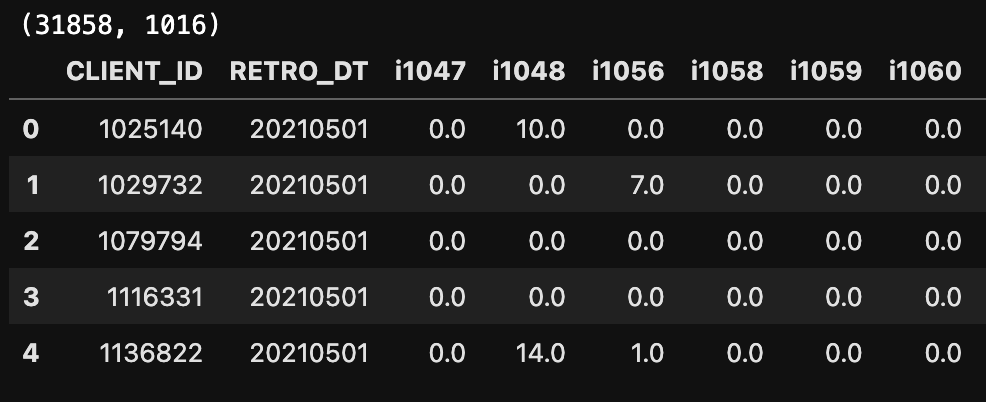
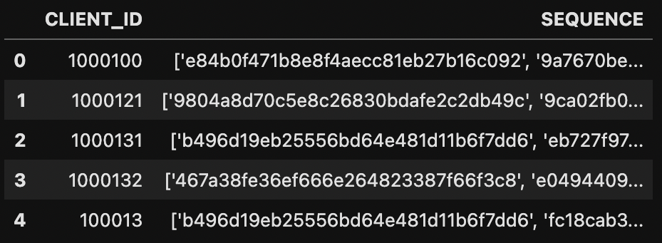

# Цифровой прорыв, 2022, Москва, команда SMILE

## Пример данных для предсказания вероятностей
- https://disk.yandex.ru/d/U1l9fXxwnQuWXg

## Использование docker контейнера

Мы рекомендуем использовать docker hub. Для скачивания введите следующую команду в терминал: . 

### Собрать контейнер в папке проекта 

Если вы все же решили собрать докер из папки, то введите следующую команду:

build: `docker build . -t smile` 

### Запуск контейнера

Для запуска контейнера есть вот такая вот чудесная команда:

`docker run -v ~/dev/data:/code/data -e INPUT_FOLDER='data/input_data' -e OUTPUT_FOLDER='data/output_data' -it smile`

Что тут есть:
- `-v ~/dev/data:/code/data` - share директория, в ней должны быть `input_folder` и `output_folder`
- `-e INPUT_FOLDER='data/input_data'` - input_data директория, содержит `test.csv`. По умолчанию всегда берется первый файл
- `-e OUTPUT_FOLDER='data/output_data'` - output_data директория, куда сохранятся вероятности
- `-it smile` - название образа

## Использование разработанного класса

Создание класса выглядет вот так:
`smile = VkSmileModel()`

### Методы

- `load_default_models(current_dir: Path)` - [static] Подгрузить и обработать входные модели и данные для модели
- `fit(X, y)` - X это сырые данные типа dask.datasets.DataFrame. y принимает np.ndarray или pd.Series
- `predict(X, friends_path: str, hash_path: str)`
  + X это сырые данные типа dask.datasets.DataFrame
  + friends_path - файл с друзьями клиентов, ниже показан пример данных файла
  + hash_path - файл с хэшами клиентов, ниже показан пример данных файла
- `predict_proba(X, friends_path: str, hash_path: str)` - Как и в предикте

df example


friends_path файл


hash_path файл


### Пример запуска предсказания вероятностей

```python
import pandas as pd
from src import VkSmileModel

# by default it uses models, placed at src/models
smile = VkSmileModel()

train_path = 'path/to/csv/file'
df = pd.read_csv(train_path, sep='\t')  # read data using dask
y = None

proba = smile.predict_proba(df,
                            friends_path='path/to/friends/csv/file',
                            hash_path='path/to/client/hashes/csv/file'
                            )
```